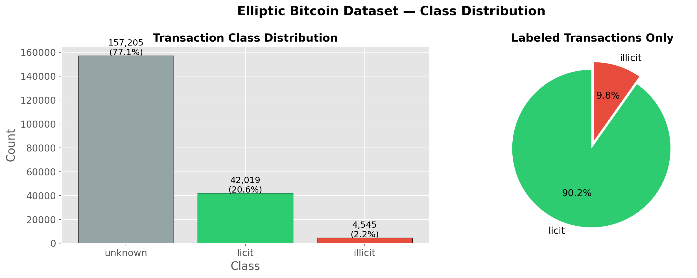
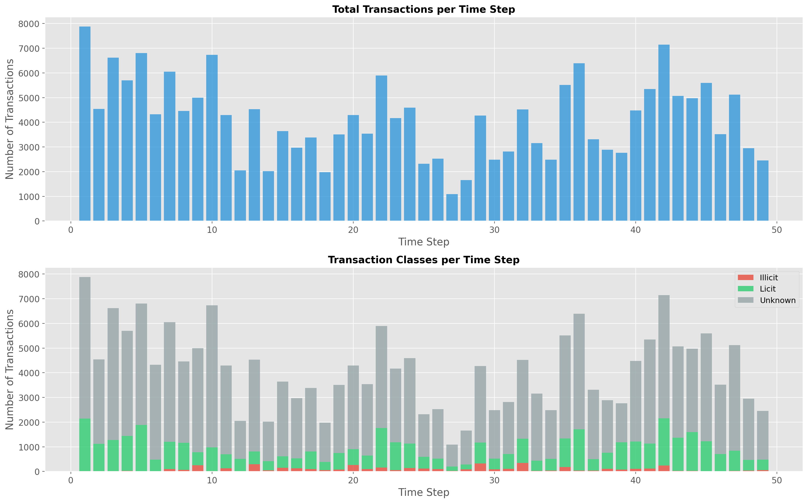
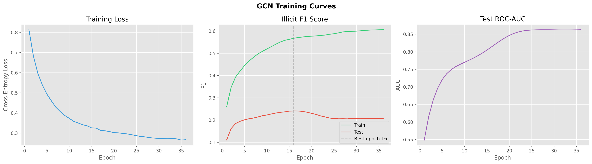
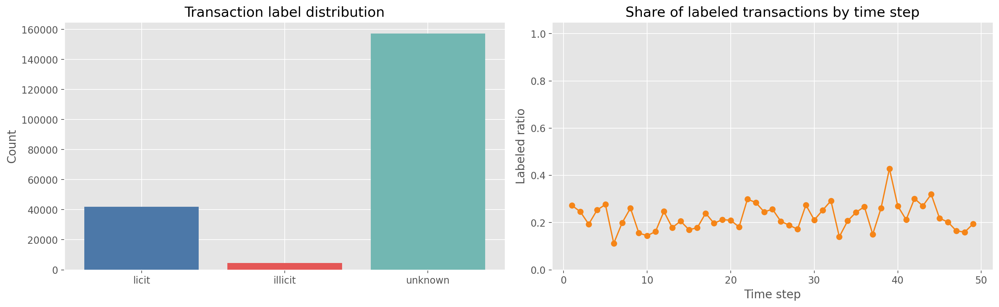
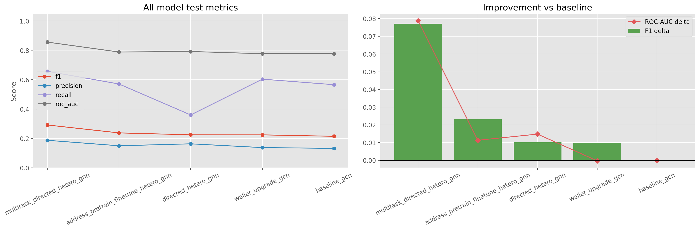

# spring-2026-financial-fraud-detection

Financial fraud detection on graph-structured data, using the Elliptic Bitcoin dataset and the richer Elliptic++ dataset.

This project compares:

- classical tabular baselines
- graph neural networks on the original Elliptic Bitcoin transaction graph
- heterogeneous graph models on Elliptic++

The main deliverables are the notebooks in `notebooks/`, the baseline scripts in `TestModels/`, and the final write-up in `REPORT_DRAFT.md` and `Fraud_Detection.tex`.

## Overview

The core idea is simple: fraud is often relational. Suspicious activity can be spread across transactions, addresses, and wallets rather than appearing as a single isolated record.

This repository therefore studies two datasets:

- `Elliptic Bitcoin`: a transaction-only graph
- `Elliptic++`: a heterogeneous graph with transaction and address/wallet nodes

The project uses temporal splits to avoid leakage from future transactions into past training data. The codebase also includes data download scripts, dataset splitters, notebook helpers, and saved figures/checkpoints from the final experiments.

## Repository Layout

```text
README.md
environment.yml
requirements.txt
scripts/
  fetch_elliptic_bitcoin_dataset.py
  fetch_elliptic_plus.py
  split_elliptic_bitcoin_dataset.py
  split_elliptic_plus_dataset.py
  run_notebook_cells.py
  requirements_elliptic.txt
notebooks/
  elliptic_EDA.ipynb
  GCN_elliptic.ipynb
  elliptic_plus_EDA.ipynb
  GCN_elliptic_plus.ipynb
  HeteroGATv2_elliptic_plus.ipynb
TestModels/
  XGBoost.ipynb
  xgboost4_formatted.ipynb
  logistic.ipynb
  GCN.ipynb
  train_elliptic_gnn.py
REPORT_DRAFT.md
Fraud_Detection.tex
outputs/
  figures/
  models/
data/
  raw/
  processed/
```

## Setup

Create the conda environment:

```bash
conda env create -f environment.yml
conda activate fraud-detection-gnn
```

If you only want the data download utilities, install the minimal dataset dependencies:

```bash
python -m pip install -r scripts/requirements_elliptic.txt
```

The project-wide Python dependencies live in `requirements.txt`.

## Data Download

### Elliptic Bitcoin

Download the original Elliptic Bitcoin dataset from Kaggle:

```bash
python scripts/fetch_elliptic_bitcoin_dataset.py
```

Optional flags:

```bash
python scripts/fetch_elliptic_bitcoin_dataset.py --load
python scripts/fetch_elliptic_bitcoin_dataset.py --no-unzip
```

Expected raw location:

```text
data/raw/elliptic_bitcoin_data/elliptic_bitcoin_dataset
```

### Elliptic++

Download the Elliptic++ dataset from Google Drive:

```bash
python scripts/fetch_elliptic_plus.py
```

Expected raw location:

```text
data/raw/elliptic++dataset
```

## Temporal Splits

The project uses temporal splits instead of random splits.

Default ratio:

- train: 70%
- validation: 15%
- test: 15%

The split scripts preserve chronology by assigning earlier time steps to train, middle time steps to validation, and later time steps to test.

If you want the imported split tables instead of the raw data, use:

- `scripts/split_elliptic_bitcoin_dataset.py` for Elliptic Bitcoin
- `scripts/split_elliptic_plus_dataset.py` for Elliptic++

### Elliptic Bitcoin split

```bash
python scripts/split_elliptic_bitcoin_dataset.py
```

Useful flags:

```bash
python scripts/split_elliptic_bitcoin_dataset.py --known-only
python scripts/split_elliptic_bitcoin_dataset.py --split-edges
```

Outputs are written to `data/processed/elliptic_bitcoin_splits/` by default.

### Elliptic++ split

```bash
python scripts/split_elliptic_plus_dataset.py
```

Useful flags:

```bash
python scripts/split_elliptic_plus_dataset.py --known-only
python scripts/split_elliptic_plus_dataset.py --split-tx-edges
```

Outputs are written to `data/processed/elliptic_plus_splits/` by default.

## Notebooks

### Elliptic Bitcoin

- `notebooks/elliptic_EDA.ipynb`: exploratory analysis of the original transaction graph
- `notebooks/GCN_elliptic.ipynb`: GCN baseline with temporal train/validation/test split and validation-based early stopping

### Elliptic++

- `notebooks/elliptic_plus_EDA.ipynb`: exploratory analysis of the transaction + address graph
- `notebooks/GCN_elliptic_plus.ipynb`: transaction-level GCN baseline on Elliptic++
- `notebooks/HeteroGATv2_elliptic_plus.ipynb`: heterogeneous GNN experiments on Elliptic++

### Tabular baselines

- `TestModels/XGBoost.ipynb`: Elliptic XGBoost baseline with temporal validation and test evaluation
- `TestModels/xgboost4_formatted.ipynb`: Elliptic++ XGBoost experiment with engineered transaction and wallet features
- `TestModels/logistic.ipynb`: logistic-regression baseline
- `TestModels/GCN.ipynb`: notebook version of the Elliptic GCN baseline

### Notebook execution helper

If you want to run a notebook headlessly cell by cell:

```bash
python scripts/run_notebook_cells.py notebooks/GCN_elliptic.ipynb
```

You can replace the notebook path with any of the other notebooks in `notebooks/`.

## Baseline Models

The `TestModels/` directory contains additional baselines and comparison experiments.

### Elliptic Bitcoin GCN

Run the main graph baseline on the Elliptic Bitcoin dataset:

```bash
python TestModels/train_elliptic_gnn.py
```

Useful options:

```bash
python TestModels/train_elliptic_gnn.py --epochs 100 --hidden-channels 128
python TestModels/train_elliptic_gnn.py --directed
python TestModels/train_elliptic_gnn.py --cpu
```

This script:

- loads `elliptic_txs_features.csv`, `elliptic_txs_edgelist.csv`, and `elliptic_txs_classes.csv`
- ignores `unknown` labels for supervised training
- creates train/validation/test masks from the known labels only
- trains a small GCN with class weighting for the imbalanced fraud labels

### Classical baselines

The `TestModels/` notebooks also include classical baselines such as XGBoost and logistic regression for comparison.

## Outputs

Generated artifacts are stored under `outputs/`:

- `outputs/figures/` for plots and evaluation visualizations
- `outputs/models/` for saved model checkpoints

These files are useful for the report and for quick visual inspection of the experiments.

## Selected Figures

### Elliptic Bitcoin







### Elliptic++





## Results Summary

The current report draft highlights the following trend:

- On the original Elliptic Bitcoin dataset, the tabular XGBoost baseline is very strong.
- On Elliptic++, the heterogeneous multi-task graph model performs best.

Representative metrics from the current experiments:

- Elliptic XGBoost test: illicit `F1 = 0.77`, `Precision = 0.81`, `Recall = 0.73`, `ROC-AUC = 0.9230`, `PR-AUC = 0.7932`
- Elliptic GCN test: illicit `F1 = 0.1868`, `Precision = 0.1062`, `Recall = 0.7767`, `ROC-AUC = 0.8112`
- Elliptic++ multi-task directed hetero GNN test: illicit `F1 = 0.2918`, `Precision = 0.1875`, `Recall = 0.6572`, `ROC-AUC = 0.8560`

See `REPORT_DRAFT.md` for the full discussion and metrics table.

## Notes

- The original Elliptic Bitcoin dataset has transactions as nodes and directed payment flows as edges.
- Elliptic++ adds address/wallet nodes and multiple edge types, which makes heterogeneous graph models a better fit.
- All split scripts and training code use temporal splits to reduce leakage.
- The split and fetch scripts are importable modules, so they can be reused from notebooks or other Python code.
